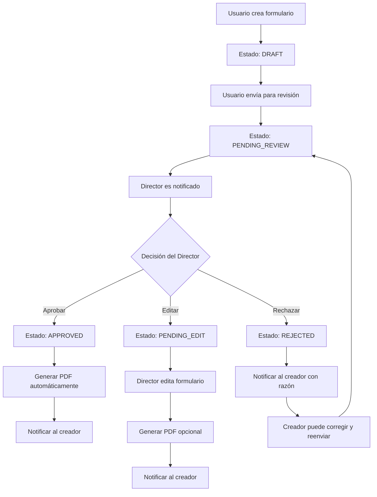

# 🏗️ Arquitectura de Workflow para Formularios

## 📋 **Flujo de Trabajo Propuesto**



## 🎯 **Componentes de la Nueva Arquitectura**

### **1. Entidades Mejoradas**

#### **BaseForm con Estados de Workflow**

```typescript
// src/entities/base/base-form.entity.ts
import {
  Entity,
  PrimaryGeneratedColumn,
  Column,
  CreateDateColumn,
  UpdateDateColumn,
  ManyToOne,
  JoinColumn,
  OneToMany,
  Index,
} from "typeorm";
import { User } from "../user.entity";
import { DocumentStatus, FORMTYPE } from "@/commons/enums";

@Entity("forms")
@Index(["type", "status"])
@Index(["createdBy", "createdAt"])
@Index(["status", "submittedAt"]) // Para consultas de pendientes
export class BaseForm {
  @PrimaryGeneratedColumn("uuid")
  id: string;

  @Column({ type: "enum", enum: FORMTYPE })
  type: FORMTYPE;

  @Column({ type: "varchar", length: 200 })
  title: string;

  @Column({ type: "enum", enum: DocumentStatus, default: DocumentStatus.DRAFT })
  status: DocumentStatus;

  @Column({ type: "int", default: 1 })
  version: number;

  @Column({ type: "jsonb", nullable: true })
  formData: Record<string, any>; // Datos específicos del formulario

  @Column({ type: "text", nullable: true })
  notes?: string;

  @Column({ type: "text", nullable: true })
  rejectionReason?: string;

  // Timestamps de workflow
  @Column({ type: "timestamp", nullable: true })
  submittedAt?: Date;

  @Column({ type: "timestamp", nullable: true })
  approvedAt?: Date;

  @Column({ type: "timestamp", nullable: true })
  rejectedAt?: Date;

  @Column({ type: "timestamp", nullable: true })
  lastEditedAt?: Date;

  // Relaciones
  @ManyToOne(() => User, { eager: true })
  @JoinColumn({ name: "created_by" })
  createdBy: User;

  @ManyToOne(() => User, { nullable: true })
  @JoinColumn({ name: "approved_by" })
  approvedBy?: User;

  @ManyToOne(() => User, { nullable: true })
  @JoinColumn({ name: "rejected_by" })
  rejectedBy?: User;

  @ManyToOne(() => User, { nullable: true })
  @JoinColumn({ name: "last_edited_by" })
  lastEditedBy?: User;

  @ManyToOne(() => BaseForm, { nullable: true })
  @JoinColumn({ name: "parent_form_id" })
  parentForm?: BaseForm; // Para versionado

  @OneToMany(() => BaseForm, (form) => form.parentForm)
  versions: BaseForm[];

  @OneToMany(() => FormNotification, (notification) => notification.form)
  notifications: FormNotification[];

  @OneToMany(() => FormAuditLog, (log) => log.form)
  auditLogs: FormAuditLog[];

  // Timestamps
  @CreateDateColumn({ name: "created_at" })
  createdAt: Date;

  @UpdateDateColumn({ name: "updated_at" })
  updatedAt: Date;

  // Métodos de negocio
  canBeEditedBy(user: User): boolean {
    if (user.role === UserRole.DIRECTOR) return true;
    if (this.createdBy.id === user.id && this.status === DocumentStatus.DRAFT)
      return true;
    if (
      this.createdBy.id === user.id &&
      this.status === DocumentStatus.REJECTED
    )
      return true;
    return false;
  }

  canBeApprovedBy(user: User): boolean {
    return (
      user.role === UserRole.DIRECTOR &&
      this.status === DocumentStatus.PENDING_REVIEW
    );
  }

  canBeRejectedBy(user: User): boolean {
    return (
      user.role === UserRole.DIRECTOR &&
      this.status === DocumentStatus.PENDING_REVIEW
    );
  }

  submitForReview(): void {
    this.status = DocumentStatus.PENDING_REVIEW;
    this.submittedAt = new Date();
  }

  approve(approvedBy: User): void {
    this.status = DocumentStatus.APPROVED;
    this.approvedBy = approvedBy;
    this.approvedAt = new Date();
  }

  reject(rejectedBy: User, reason: string): void {
    this.status = DocumentStatus.REJECTED;
    this.rejectedBy = rejectedBy;
    this.rejectedAt = new Date();
    this.rejectionReason = reason;
  }

  markAsEdited(editedBy: User): void {
    this.lastEditedBy = editedBy;
    this.lastEditedAt = new Date();
    this.version += 1;
  }
}
```

#### **Sistema de Notificaciones**

```typescript
// src/entities/form-notification.entity.ts
import {
  Entity,
  PrimaryGeneratedColumn,
  Column,
  CreateDateColumn,
  ManyToOne,
  JoinColumn,
  Index,
} from "typeorm";
import { BaseForm } from "./base/base-form.entity";
import { User } from "./user.entity";

export enum NotificationType {
  FORM_SUBMITTED = "FORM_SUBMITTED",
  FORM_APPROVED = "FORM_APPROVED",
  FORM_REJECTED = "FORM_REJECTED",
  FORM_EDITED_BY_DIRECTOR = "FORM_EDITED_BY_DIRECTOR",
  FORM_REQUIRES_REVIEW = "FORM_REQUIRES_REVIEW",
}

export enum NotificationStatus {
  UNREAD = "UNREAD",
  READ = "READ",
  ARCHIVED = "ARCHIVED",
}

@Entity("form_notifications")
@Index(["recipient", "status", "createdAt"])
@Index(["form", "type"])
export class FormNotification {
  @PrimaryGeneratedColumn("uuid")
  id: string;

  @Column({ type: "enum", enum: NotificationType })
  type: NotificationType;

  @Column({
    type: "enum",
    enum: NotificationStatus,
    default: NotificationStatus.UNREAD,
  })
  status: NotificationStatus;

  @Column({ type: "varchar", length: 200 })
  title: string;

  @Column({ type: "text" })
  message: string;

  @Column({ type: "jsonb", nullable: true })
  metadata: Record<string, any>;

  @ManyToOne(() => BaseForm, (form) => form.notifications, {
    onDelete: "CASCADE",
  })
  @JoinColumn({ name: "form_id" })
  form: BaseForm;

  @ManyToOne(() => User)
  @JoinColumn({ name: "recipient_id" })
  recipient: User;

  @ManyToOne(() => User, { nullable: true })
  @JoinColumn({ name: "sender_id" })
  sender?: User;

  @CreateDateColumn({ name: "created_at" })
  createdAt: Date;

  @Column({ type: "timestamp", nullable: true })
  readAt?: Date;
}
```

### **2. Servicio de Permisos**

```typescript
// src/modules/forms/services/permissions.service.ts
import { Injectable } from "@nestjs/common";
import { UserRole, FORMTYPE } from "@/commons/enums";

@Injectable()
export class FormPermissionsService {
  private readonly rolePermissions: Record<UserRole, FORMTYPE[]> = {
    [UserRole.DIRECTOR]: Object.values(FORMTYPE),
    [UserRole.COORDINADOR_UNO]: [
      FORMTYPE.INFORME_SEMESTRAL,
      FORMTYPE.INFORME_ADMISION,
      FORMTYPE.PLAN_TRABAJO,
      FORMTYPE.SEGUIMIENTO_ACOMPANANTE,
      FORMTYPE.ACTAS,
      FORMTYPE.FACTURA,
      FORMTYPE.REPORTE_MENSUAL,
    ],
    [UserRole.COORDINADOR_DOS]: [
      FORMTYPE.SEGUIMIENTO_FAMILIA,
      FORMTYPE.ACTAS,
      FORMTYPE.FACTURA,
      FORMTYPE.INFORME_SEMESTRAL,
    ],
    [UserRole.TERAPEUTA]: [
      FORMTYPE.PLAN_TRABAJO,
      FORMTYPE.INFORME_SEMESTRAL,
      FORMTYPE.ACTAS,
      FORMTYPE.FACTURA,
      FORMTYPE.INFORME_ADMISION,
    ],
    [UserRole.ACOMPANIANTE_EXTERNO]: [
      FORMTYPE.REPORTE_MENSUAL,
      FORMTYPE.PLAN_TRABAJO,
      FORMTYPE.FACTURA,
    ],
  };

  canCreateForm(userRole: UserRole, formType: FORMTYPE): boolean {
    return this.rolePermissions[userRole]?.includes(formType) ?? false;
  }

  canApproveForms(userRole: UserRole): boolean {
    return userRole === UserRole.DIRECTOR;
  }

  canEditForm(
    userRole: UserRole,
    formOwnerId: string,
    userId: string
  ): boolean {
    if (userRole === UserRole.DIRECTOR) return true;
    return formOwnerId === userId;
  }

  getAllowedFormTypes(userRole: UserRole): FORMTYPE[] {
    return this.rolePermissions[userRole] || [];
  }
}
```

### **3. Servicio de Notificaciones**

```typescript
// src/modules/forms/services/notification.service.ts
import { Injectable } from "@nestjs/common";
import { InjectRepository } from "@nestjs/typeorm";
import { Repository } from "typeorm";
import {
  FormNotification,
  NotificationType,
} from "@/entities/form-notification.entity";
import { BaseForm } from "@/entities/base/base-form.entity";
import { User } from "@/entities/user.entity";

@Injectable()
export class NotificationService {
  constructor(
    @InjectRepository(FormNotification)
    private notificationRepository: Repository<FormNotification>
  ) {}

  async notifyFormSubmitted(form: BaseForm): Promise<void> {
    // Notificar al director
    const director = await this.getDirector();
    if (director) {
      await this.createNotification({
        type: NotificationType.FORM_REQUIRES_REVIEW,
        title: `Nuevo formulario para revisar: ${form.title}`,
        message: `${form.createdBy.fullName} ha enviado un formulario de tipo ${form.type} para revisión.`,
        form,
        recipient: director,
        sender: form.createdBy,
        metadata: {
          formType: form.type,
          formId: form.id,
        },
      });
    }
  }

  async notifyFormApproved(form: BaseForm): Promise<void> {
    await this.createNotification({
      type: NotificationType.FORM_APPROVED,
      title: `Formulario aprobado: ${form.title}`,
      message: `Tu formulario de tipo ${form.type} ha sido aprobado por el director.`,
      form,
      recipient: form.createdBy,
      sender: form.approvedBy,
      metadata: {
        formType: form.type,
        formId: form.id,
        approvedAt: form.approvedAt,
      },
    });
  }

  async notifyFormRejected(form: BaseForm): Promise<void> {
    await this.createNotification({
      type: NotificationType.FORM_REJECTED,
      title: `Formulario rechazado: ${form.title}`,
      message: `Tu formulario de tipo ${form.type} ha sido rechazado. Razón: ${form.rejectionReason}`,
      form,
      recipient: form.createdBy,
      sender: form.rejectedBy,
      metadata: {
        formType: form.type,
        formId: form.id,
        rejectionReason: form.rejectionReason,
        rejectedAt: form.rejectedAt,
      },
    });
  }

  async notifyFormEditedByDirector(form: BaseForm): Promise<void> {
    await this.createNotification({
      type: NotificationType.FORM_EDITED_BY_DIRECTOR,
      title: `Formulario editado por director: ${form.title}`,
      message: `El director ha editado tu formulario de tipo ${form.type}. Revisa los cambios realizados.`,
      form,
      recipient: form.createdBy,
      sender: form.lastEditedBy,
      metadata: {
        formType: form.type,
        formId: form.id,
        editedAt: form.lastEditedAt,
        version: form.version,
      },
    });
  }

  private async createNotification(data: {
    type: NotificationType;
    title: string;
    message: string;
    form: BaseForm;
    recipient: User;
    sender?: User;
    metadata?: Record<string, any>;
  }): Promise<FormNotification> {
    const notification = this.notificationRepository.create({
      type: data.type,
      title: data.title,
      message: data.message,
      form: data.form,
      recipient: data.recipient,
      sender: data.sender,
      metadata: data.metadata,
    });

    return this.notificationRepository.save(notification);
  }

  private async getDirector(): Promise<User | null> {
    // Implementar lógica para obtener el director
    // Esto podría ser desde un servicio de usuarios o configuración
    return null; // Placeholder
  }
}
```

### **4. Servicio de Workflow Mejorado**

```typescript
// src/modules/forms/services/workflow.service.ts
import {
  Injectable,
  BadRequestException,
  ForbiddenException,
} from "@nestjs/common";
import { InjectRepository } from "@nestjs/typeorm";
import { Repository } from "typeorm";
import { BaseForm } from "@/entities/base/base-form.entity";
import { User } from "@/entities/user.entity";
import { DocumentStatus } from "@/commons/enums";
import { NotificationService } from "./notification.service";
import { FormAuditLog, AuditAction } from "@/entities/form-audit-log.entity";

@Injectable()
export class WorkflowService {
  constructor(
    @InjectRepository(BaseForm)
    private formRepository: Repository<BaseForm>,
    @InjectRepository(FormAuditLog)
    private auditRepository: Repository<FormAuditLog>,
    private notificationService: NotificationService
  ) {}

  async submitForReview(formId: string, user: User): Promise<BaseForm> {
    const form = await this.formRepository.findOne({
      where: { id: formId },
      relations: ["createdBy"],
    });

    if (!form) {
      throw new BadRequestException("Formulario no encontrado");
    }

    if (!form.canBeEditedBy(user)) {
      throw new ForbiddenException(
        "No tienes permisos para enviar este formulario"
      );
    }

    if (form.status !== DocumentStatus.DRAFT) {
      throw new BadRequestException(
        "Solo se pueden enviar formularios en estado borrador"
      );
    }

    // Cambiar estado
    form.submitForReview();

    // Guardar cambios
    const savedForm = await this.formRepository.save(form);

    // Crear log de auditoría
    await this.createAuditLog(
      form,
      AuditAction.SUBMITTED,
      user,
      "Formulario enviado para revisión"
    );

    // Enviar notificación
    await this.notificationService.notifyFormSubmitted(savedForm);

    return savedForm;
  }

  async approveForm(formId: string, director: User): Promise<BaseForm> {
    const form = await this.formRepository.findOne({
      where: { id: formId },
      relations: ["createdBy"],
    });

    if (!form) {
      throw new BadRequestException("Formulario no encontrado");
    }

    if (!form.canBeApprovedBy(director)) {
      throw new ForbiddenException(
        "No tienes permisos para aprobar este formulario"
      );
    }

    // Aprobar formulario
    form.approve(director);

    // Guardar cambios
    const savedForm = await this.formRepository.save(form);

    // Crear log de auditoría
    await this.createAuditLog(
      form,
      AuditAction.APPROVED,
      director,
      "Formulario aprobado"
    );

    // Enviar notificación
    await this.notificationService.notifyFormApproved(savedForm);

    // TODO: Generar PDF automáticamente
    // await this.pdfService.generateFormPDF(savedForm);

    return savedForm;
  }

  async rejectForm(
    formId: string,
    director: User,
    reason: string
  ): Promise<BaseForm> {
    const form = await this.formRepository.findOne({
      where: { id: formId },
      relations: ["createdBy"],
    });

    if (!form) {
      throw new BadRequestException("Formulario no encontrado");
    }

    if (!form.canBeRejectedBy(director)) {
      throw new ForbiddenException(
        "No tienes permisos para rechazar este formulario"
      );
    }

    // Rechazar formulario
    form.reject(director, reason);

    // Guardar cambios
    const savedForm = await this.formRepository.save(form);

    // Crear log de auditoría
    await this.createAuditLog(
      form,
      AuditAction.REJECTED,
      director,
      `Formulario rechazado: ${reason}`
    );

    // Enviar notificación
    await this.notificationService.notifyFormRejected(savedForm);

    return savedForm;
  }

  async editFormByDirector(
    formId: string,
    director: User,
    updates: Partial<BaseForm>
  ): Promise<BaseForm> {
    const form = await this.formRepository.findOne({
      where: { id: formId },
      relations: ["createdBy"],
    });

    if (!form) {
      throw new BadRequestException("Formulario no encontrado");
    }

    if (director.role !== UserRole.DIRECTOR) {
      throw new ForbiddenException("Solo el director puede editar formularios");
    }

    // Marcar como editado por director
    form.markAsEdited(director);
    form.status = DocumentStatus.PENDING_EDIT;

    // Aplicar actualizaciones
    Object.assign(form, updates);

    // Guardar cambios
    const savedForm = await this.formRepository.save(form);

    // Crear log de auditoría
    await this.createAuditLog(
      form,
      AuditAction.UPDATED,
      director,
      "Formulario editado por director",
      updates
    );

    // Enviar notificación
    await this.notificationService.notifyFormEditedByDirector(savedForm);

    return savedForm;
  }

  private async createAuditLog(
    form: BaseForm,
    action: AuditAction,
    user: User,
    description: string,
    changes?: Record<string, any>
  ): Promise<void> {
    const auditLog = this.auditRepository.create({
      form,
      action,
      description,
      changes,
      user,
      ipAddress: "127.0.0.1", // TODO: Obtener IP real del request
      userAgent: "API Client", // TODO: Obtener User-Agent real
    });

    await this.auditRepository.save(auditLog);
  }
}
```

### **5. Controlador Mejorado**

```typescript
// src/modules/forms/forms.controller.ts
import {
  Controller,
  Post,
  Body,
  Get,
  Query,
  Patch,
  Param,
  ParseUUIDPipe,
  UseGuards,
} from "@nestjs/common";
import {
  ApiTags,
  ApiOperation,
  ApiResponse,
  ApiBearerAuth,
} from "@nestjs/swagger";
import { FormsService } from "./forms.service";
import { WorkflowService } from "./services/workflow.service";
import { FormPermissionsService } from "./services/permissions.service";
import { CurrentUser } from "../auth";
import { CreateFormDto } from "./dto/create-form.dto";
import { ApproveFormDto, RejectFormDto, EditFormDto } from "./dto/workflow.dto";
import { User } from "@/entities";
import { FORMTYPE, UserRole } from "@/commons/enums";
import {
  RateLimitGuard,
  GeneralRateLimit,
} from "../auth/guards/rate-limit.guard";

@ApiTags("Formularios")
@Controller("forms")
@ApiBearerAuth()
export class FormsController {
  constructor(
    private readonly formsService: FormsService,
    private readonly workflowService: WorkflowService,
    private readonly permissionsService: FormPermissionsService
  ) {}

  @Post()
  @UseGuards(RateLimitGuard)
  @GeneralRateLimit()
  @ApiOperation({
    summary: "Crear formulario",
    description: "Crea un nuevo formulario según el tipo y rol del usuario",
  })
  @ApiResponse({
    status: 201,
    description: "Formulario creado exitosamente",
  })
  @ApiResponse({
    status: 403,
    description: "Permisos insuficientes para crear este tipo de formulario",
  })
  async create(@Body() body: CreateFormDto, @CurrentUser() user: User) {
    // Validar permisos usando el servicio
    if (!this.permissionsService.canCreateForm(user.role, body.type)) {
      throw new ForbiddenException(
        `Acceso denegado: el rol "${user.role}" no puede crear formularios de tipo "${body.type}"`
      );
    }

    return this.formsService.create(
      body.type,
      body.baseData,
      body.specificData,
      user
    );
  }

  @Post(":id/submit")
  @ApiOperation({
    summary: "Enviar formulario para revisión",
    description:
      "Envía un formulario en estado borrador para revisión del director",
  })
  async submitForReview(
    @Param("id", ParseUUIDPipe) id: string,
    @CurrentUser() user: User
  ) {
    return this.workflowService.submitForReview(id, user);
  }

  @Patch(":id/approve")
  @ApiOperation({
    summary: "Aprobar formulario",
    description: "Aprueba un formulario pendiente de revisión (solo director)",
  })
  async approveForm(
    @Param("id", ParseUUIDPipe) id: string,
    @Body() body: ApproveFormDto,
    @CurrentUser() user: User
  ) {
    return this.workflowService.approveForm(id, user);
  }

  @Patch(":id/reject")
  @ApiOperation({
    summary: "Rechazar formulario",
    description:
      "Rechaza un formulario pendiente de revisión con razón (solo director)",
  })
  async rejectForm(
    @Param("id", ParseUUIDPipe) id: string,
    @Body() body: RejectFormDto,
    @CurrentUser() user: User
  ) {
    return this.workflowService.rejectForm(id, user, body.reason);
  }

  @Patch(":id/edit")
  @ApiOperation({
    summary: "Editar formulario",
    description:
      "Edita un formulario (director puede editar cualquier formulario)",
  })
  async editForm(
    @Param("id", ParseUUIDPipe) id: string,
    @Body() body: EditFormDto,
    @CurrentUser() user: User
  ) {
    return this.workflowService.editFormByDirector(id, user, body.updates);
  }

  @Get("pending")
  @ApiOperation({
    summary: "Obtener formularios pendientes",
    description: "Obtiene todos los formularios pendientes de revisión",
  })
  async getPendingForms(@CurrentUser() user: User) {
    if (!this.permissionsService.canApproveForms(user.role)) {
      throw new ForbiddenException(
        "Solo el director puede ver formularios pendientes"
      );
    }

    return this.formsService.getPendingForms();
  }

  @Get("my-forms")
  @ApiOperation({
    summary: "Obtener mis formularios",
    description:
      "Obtiene todos los formularios creados por el usuario autenticado",
  })
  async getMyForms(@CurrentUser() user: User) {
    return this.formsService.getFormsByUser(user.id);
  }

  @Get("notifications")
  @ApiOperation({
    summary: "Obtener notificaciones",
    description: "Obtiene las notificaciones del usuario autenticado",
  })
  async getNotifications(@CurrentUser() user: User) {
    return this.formsService.getUserNotifications(user.id);
  }
}
```

## 🎯 **Beneficios de la Nueva Arquitectura**

### **1. Separación de Responsabilidades**

- ✅ Lógica de permisos en servicio dedicado
- ✅ Workflow en servicio especializado
- ✅ Notificaciones en servicio independiente
- ✅ Controlador solo maneja HTTP

### **2. Workflow Completo**

- ✅ Estados claros y transiciones controladas
- ✅ Notificaciones automáticas en cada cambio
- ✅ Auditoría completa de todas las acciones
- ✅ Permisos granulares por acción

### **3. Escalabilidad**

- ✅ Fácil agregar nuevos estados
- ✅ Sistema de notificaciones extensible
- ✅ Auditoría preparada para compliance
- ✅ Rate limiting en endpoints críticos

### **4. Mantenibilidad**

- ✅ Código organizado en servicios especializados
- ✅ DTOs específicos para cada operación
- ✅ Validaciones centralizadas
- ✅ Manejo de errores consistente

## 🚀 **Próximos Pasos**

1. **Implementar entidades mejoradas** con estados de workflow
2. **Crear servicios especializados** para permisos, workflow y notificaciones
3. **Actualizar controladores** con endpoints de workflow
4. **Implementar sistema de notificaciones** (email, push, etc.)
5. **Agregar generación automática de PDFs**
6. **Crear tests unitarios** para todos los servicios

¿Te gustaría que proceda con la implementación de alguna de estas mejoras específicas?

